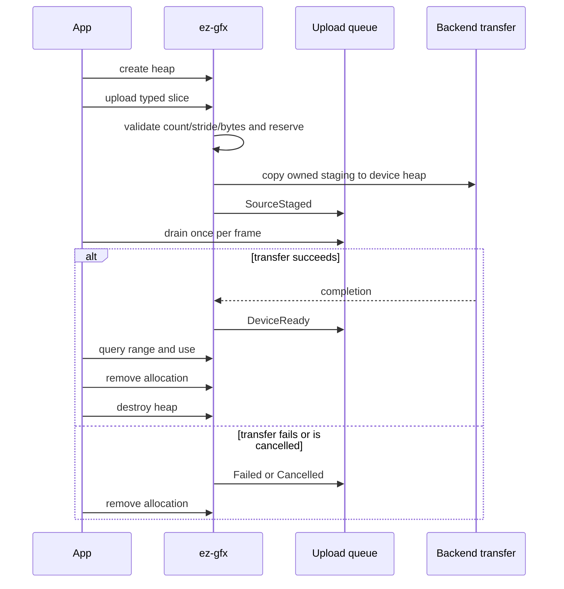

# Geometry

Geometry uses named device-local vertex heaps and one context-wide device-local `u32` index heap. Structured and indirect buffers are separate transient per-frame resources.

## Public path

1. Create each vertex heap with a unique semantic name, byte capacity, and stride; retain the returned `VertexHeapHandle`.
2. Create the index heap with a byte capacity divisible by four.
3. Upload a typed `Pod` vertex slice through its heap handle, or `&[u32]` indices. Uploads infer count/bytes and return typed owner- and generation-validated allocation handles.
4. Query allocation ranges for indirect draw offsets.
5. Poll upload events until empty once per frame.
6. Remove allocations before destroying their typed heap handle.

The safe API exports:

- `create_vertex_heap`, `upload_vertices`, `vertex_allocation_range`, `remove_vertices`, `destroy_vertex_heap`;
- `create_index_heap`, `upload_indices`, `index_allocation_range`, `remove_indices`, `destroy_index_heap`;
- `poll_upload_event`.

The C ABI mirrors these operations with opaque `EzGfxVertexHeap`, `EzGfxVertexAllocation`, and `EzGfxIndexAllocation` handles. Semantic names are used only at heap creation and internal shader reflection lookup.



## Shader reflection and frame binding

A shader declares a named heap explicitly:

```slang
[VertexHeap("positions")]
StructuredBuffer<float4> positions;
```

Reflection records `VertexHeap` separately from `StructuredBuffer`. Applications do not supply a `PublicBinding` for it. Frame recording imports the named heap automatically and each backend lowers it to its private descriptor layout. Vulkan, Direct3D 12, and Metal retain distinct physical layouts behind the same public contract.

The global index heap remains a native index-buffer binding. `DrawIndexedCommand::first_index` is the queried index allocation start plus any mesh-local index offset. Because a vertex heap is bound at byte offset zero, `vertex_offset` must include the queried vertex allocation start.

## Allocation and removal

Each heap uses an ordered range free list. Allocation validates stride, capacity, arithmetic, heap ownership, handle owner, resource kind, and generation. Allocation handles record their heap owner, so removal needs no caller-supplied name and rejects stale, foreign, and wrong-kind handles.

Removal waits for native idle before returning a range to the free list. Heap destruction is rejected internally while allocations are live or that heap is referenced by the current recorded frame; the void public destruction call leaves the heap intact on rejection.

## Upload events

`upload_vertices<T: Pod>` and `upload_indices(&[u32])` enqueue lossless typed transitions:

- `SourceStaged`: caller bytes were copied into runtime-owned mapped staging and may be released;
- `DeviceReady`: the device-local allocation completed transfer;
- `Failed(status)`: terminal upload failure;
- `Cancelled`: terminal cancellation where supported.

The queue is unbounded and never shares the bounded diagnostic queue. Poll until `None` every frame to avoid retaining events indefinitely. Context destruction drops remaining events after draining owned work.

A heap-level maximum readiness token is still used when a frame imports a named heap. It may wait for a later allocation in the same heap, but never permits early use.

## Admission and copies

Geometry staging grows subject to allocator and OS failure, not a fixed slot count. Reusable mapped buckets retire by completion token and are reused only after completion.

The typed slice upload API derives and checks count, stride, multiplication, and byte length before one caller-slice to mapped-staging copy, followed by the GPU copy. Raw pointer/count conversion and the 16 MiB caller boundary remain in `ez-gfx-ffi`. The API does not provide a direct mapped lease. Procedural zero-copy staging leases remain planned work; current APIs and plans must not claim that feature is implemented.

## Transient frame buffers

After beginning a frame, applications acquire fresh structured and indirect handles. `acquire_structured<T: Pod>` derives stride and capacity; `write_structured` validates type stride and a checked element range. `write_indirect` accepts a slice and advances the active count to the maximum written end, so CPU-written commands need no separate count call.

Compute-generated indirect bytes cannot update CPU publication metadata. `publish_compute_indirect_count` narrowly supplies that known count before compute and graphics share the handle in one frame. Once a transient is recorded, CPU writes/releases fail; after successful submission its handle is stale. Native storage is pooled against the exact graphics completion token, trimmed only after completion, and quarantined until context teardown if a failed submission cannot prove idle.

## Examples

All Rust examples acquire structured and indirect buffers inside each frame. Vertex heap handles and geometry allocations remain persistent. ImGui keeps the immutable identity sequence in the global index heap while refreshing its transient command metadata and indirect commands per frame.

## Verification

Proof on 2026-09-08: workspace nextest 555/555 plus doc tests, hidden examples 32/32, focused ABI 29/29, error 2/2, and Vulkan/DX12 PSO 2/2 passed. Local Windows proof passed the 60-second per-case HAL/Vulkan/DX12/safe-facade matrix 94/94, ABI 30 C11/C++17 header probes, export parity for 64 functions and all declarations/layouts, and the MSVC C textured-cube build. Exact remote matrices passed on Linux Vulkan 73/73 and macOS Metal 51/51. Source-line limits, strict workspace all-target/all-feature Clippy with warnings denied, and final formatting also passed.
