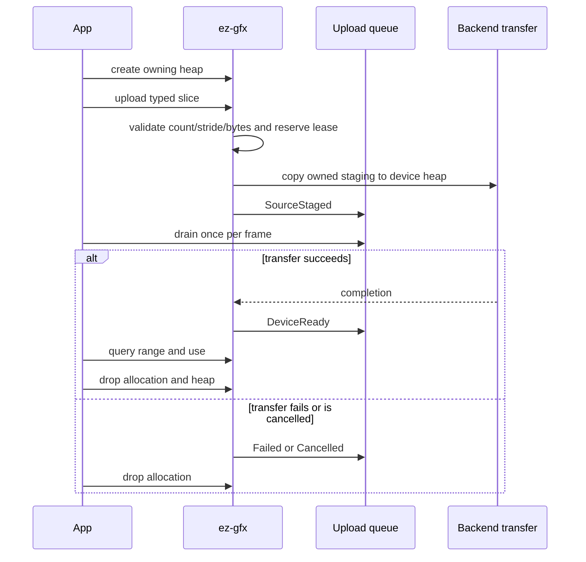

# Geometry

Geometry uses owning auto-growing named vertex heaps and one lazy context-owned device-local `u32` index heap. Their allocation wrappers retain both the shared `Rc<ContextInner>` and the parent resource lease. Structured and counter buffers are separate one-frame consumables.

## Public path

1. Create each typed vertex heap with a unique semantic name through `Context::create_vertex_heap<T>(name)`; retain its owning `VertexHeap<T>`.
2. Call `VertexHeap::upload(&[T])` or `Context::upload_indices(&[u32])`; the index heap is created lazily, and each upload returns an owning generation-validated allocation.
3. Query `VertexAllocation::range` or `IndexAllocation::range` for indirect draw offsets.
4. Register one `Context` callback for upload, runtime, diagnostic, and readback events.
5. Drop heaps and allocations independently. Allocation leases keep their parent heap and context alive until cleanup is safe.

The C ABI keeps vertex heaps explicit because C has no RAII. Index storage remains a lazy context-owned singleton with upload, range-query, and allocation-release operations only.



## Shader reflection and frame binding

A shader declares a named heap explicitly:

```slang
[VertexHeap("positions")]
StructuredBuffer<float4> positions;
```

Reflection records `VertexHeap` separately from `StructuredBuffer`. Applications do not supply a `PublicBinding` for it. Frame recording imports the named heap automatically and each backend lowers it to its private descriptor layout. Vulkan, Direct3D 12, and Metal retain distinct physical layouts behind the same public contract.

The global index heap remains a native index-buffer binding. `DrawIndexedCommand::first_index` is the queried index allocation start plus any mesh-local index offset. Because a vertex heap is bound at byte offset zero, `vertex_offset` must include the queried vertex allocation start.

## Allocation and removal

Each heap uses an ordered range free list. Allocation validates stride, capacity, arithmetic, heap ownership, handle owner, resource kind, and generation. An allocation wrapper retains its parent heap. Dropping it during recording invalidates its public identity immediately but defers range reuse through that frame's terminal completion; this conservative context registry rule makes public per-frame allocation retention unnecessary. Stale, foreign, wrong-kind, and duplicate C releases remain rejected.

The index heap is a context singleton, not a freely creatable family of named heaps. Physical heap generations are imported lazily and remain completion-gated; parent resources remain leased until their children and recorded uses are gone.
## Upload events

`VertexHeap::upload(&[T])` and `Context::upload_indices(&[u32])` enqueue lossless typed transitions: `SourceStaged`, `DeviceReady`, `Failed(status)`, or `Cancelled`.

`Context::register_callback` is the sole safe event channel. The facade dispatches queued events at creator-thread operation seams; applications do not poll internal runtime queues.

A heap-level maximum readiness token is used when a frame imports a named heap. It may wait for a later allocation in the same heap, but never permits early use.

## Admission and copies

Geometry staging grows subject to allocator and OS failure, not a fixed slot count. Reusable mapped buckets retire by completion token and are reused only after completion.

The typed slice upload interface derives and checks count, stride, multiplication, and byte length before one caller-slice to mapped-staging copy, followed by the GPU copy. Raw pointer/count conversion and the 16 MiB caller boundary remain in `ez-gfx-ffi`. The interface does not provide a direct mapped lease.

## One-frame buffers

Applications acquire `Buffer<T>` and `CounterBuffer<T>` from `Context`, then populate them before a frame first uses them. `acquire_buffer_from` and `acquire_counter_buffer_from` size and initialize storage from `BufferSource::one(&value)`, a slice, or a borrowed `Vec<T>` without an intermediate collection; arrays use `.as_slice()` to make element intent explicit. The counter helper publishes the input length.

The first frame binding claims a buffer. Repeated bindings in that frame, including compute followed by graphics, share one native materialization. Writes and publication after claim fail with `NotReady`; any later frame use also fails. Finishing or aborting consumes the wrapper. Native allocations are recycled through completion-gated Vulkan, Direct3D 12, and Metal pools, or quarantined after indeterminate native failure.

## Frame ownership

`Surface::begin_frame()` creates an owning target-less `Frame`; `Frame::configure_swapchain(size, format)` attaches presentation. Named targets use `Context::begin_frame()` and `Frame::configure_render_target(name, size, format)`. `Frame::finish(self)` preserves exact errors. `Drop` aborts an unfinished frame, so safe Rust exposes no frame-end, frame-abort, or transient-release functions.

## Examples

Each main visibly creates its `Context` with `Context::new(ContextOptions { .. })` and `Surface` with `context.create_surface(SurfaceOptions { .. })` and owns them directly. The shared `Example` host retains native window, resize/input/automation, observation callbacks, and consuming frame dispatch. Each procedural loop passes `&Surface` to `wait_for_next_frame`, calls `surface.begin_frame()`, explicitly configures the swapchain from `window_frame.size`, records, then passes both `Frame` and `RenderTarget` to `Example::handle_frame`. Inner resource scopes end first; each main then drops `Surface`, consumes `Context::close` to propagate teardown errors, and finally drops `Example`. Host `Drop` only publishes completed automation output. Publication failure emits one diagnostic and exits nonzero during normal automation, but does not replace an active unwind.
