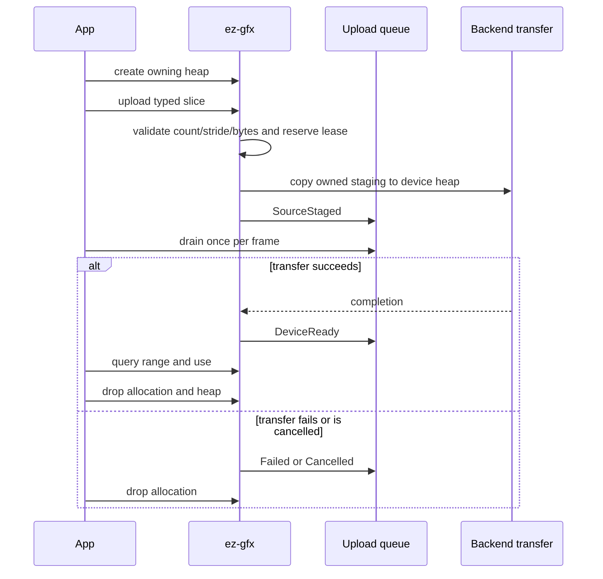

# Geometry

Geometry uses owning auto-growing named vertex heaps and one lazy context-owned device-local `u32` index heap. Their allocation wrappers retain both the shared `Rc<ContextInner>` and the parent resource lease. `Buffer`, `CounterBuffer`, and `ValueBuffer` are separate one-frame consumables bound by shader-declared name.

## Public path

1. Create each typed vertex heap with a unique semantic name through `Context::create_vertex_heap<T>(name)`; retain its owning `VertexHeap<T>`.
2. Call `VertexHeap::upload(&[T])` or `Context::upload_indices(&[u32])`; the index heap is created lazily, and each upload returns an owning generation-validated allocation.
3. Query `VertexAllocation::range` or `IndexAllocation::range` for indirect draw offsets.
4. Register one `Context` callback for upload, runtime, diagnostic, and readback events.
5. Drop heaps and allocations independently. Allocation leases keep their parent heap and context alive until cleanup is safe.

The C ABI keeps vertex heaps explicit because C has no RAII. Index storage remains a lazy context-owned singleton with upload, range-query, and allocation-release operations only.



## Shader reflection and frame binding

A shader declares a named heap explicitly:

```slang
[VertexHeap("positions")]
StructuredBuffer<float4> positions;
```

Reflection records `VertexHeap` separately from `StructuredBuffer`. Applications do not supply a `PublicBinding` for it. Frame recording imports the named heap automatically and each backend lowers it to its private descriptor layout. Vulkan, Direct3D 12, and Metal retain distinct physical layouts behind the same public contract.

Buffer and counter resources bind by shader-declared name: `[Buffer("name")]` and `[CounterBuffer("name")]` reflect as `buffer` and `counter_buffer` binding kinds. `Frame::bind_buffer` adds or replaces one named entry in the frame binding set without materializing a never-executed replacement. `execute_compute` and `execute_graphics` materialize and read the current set without removing entries, so unchanged resources remain bound across same-frame compute and graphics work. Single POD constants bind the same way as `ValueBuffer`, not as push-constant bytes. ABI 40 exposes the same persistent frame-local set through `ez_gfx_frame_bind` and `ez_gfx_frame_execute_compute`/`graphics`; terminal end or abort clears it.

The global index heap remains a native index-buffer binding. `DrawIndexedCommand::first_index` is the queried index allocation start plus any mesh-local index offset. Because a vertex heap is bound at byte offset zero, `vertex_offset` must include the queried vertex allocation start.

## Allocation and removal

Each heap uses an ordered range free list. Allocation validates stride, capacity, arithmetic, heap ownership, handle owner, resource kind, and generation. An allocation wrapper retains its parent heap. Dropping it during recording invalidates its public identity immediately but defers range reuse through that frame's terminal completion; this conservative context registry rule makes public per-frame allocation retention unnecessary. Stale, foreign, wrong-kind, and duplicate C releases remain rejected.

The index heap is a context singleton, not a freely creatable family of named heaps. Physical heap generations are imported lazily and remain completion-gated; parent resources remain leased until their children and recorded uses are gone.
## Upload events

`VertexHeap::upload(&[T])` and `Context::upload_indices(&[u32])` enqueue lossless typed transitions: `SourceStaged`, `DeviceReady`, `Failed(status)`, or `Cancelled`.

`Context::register_callback` is the sole safe event channel. The facade dispatches queued events at creator-thread operation seams; applications do not poll internal runtime queues.

A heap-level maximum readiness token is used when a frame imports a named heap. It may wait for a later allocation in the same heap, but never permits early use.

## Pending-upload diagnostics

`Context::resource_diagnostics` reports `pending_vertex_uploads` and `pending_index_uploads` as outstanding upload allocations with their reserved byte sizes in `pending_vertex_bytes` and `pending_index_bytes`. Vertex allocations count once each regardless of element width; index allocations count once each for packed `u32` ranges. A retired-but-unswept transfer keeps its pending key after its live range is reclaimed and contributes no size rather than failing the observation. The C ABI exposes the same snapshot through `ez_gfx_context_get_resource_diagnostics` at ABI 40.

## Admission and copies

Geometry staging grows subject to allocator and OS failure, not a fixed slot count. Reusable mapped buckets retire by completion token and are reused only after completion.

The typed slice upload interface derives and checks count, stride, multiplication, and byte length before one caller-slice to mapped-staging copy, followed by the GPU copy. Raw pointer/count conversion and the 16 MiB caller boundary remain in `ez-gfx-ffi`. The interface does not provide a direct mapped lease.

## One-frame buffers

Applications acquire `Buffer<T>`, `CounterBuffer<T>`, and single-value `ValueBuffer<T>` (`acquire_value_buffer`) from `Context`, then populate them before a frame first uses them. `acquire_buffer_from` and `acquire_counter_buffer_from` size and initialize storage from `BufferSource::one(&value)`, a slice, or a borrowed `Vec<T>` without an intermediate collection; arrays use `.as_slice()` to make element intent explicit. The counter helper publishes the input length. Shaders use counters through `set_count`/`add_count`/`set`/`get` over a GPU-writable count plus elements.

The first execute call using a bound buffer claims and materializes it. Later execute calls in that frame, including compute followed by graphics, reuse the same native materialization while the binding remains current. Replacing an unexecuted entry leaves its prior buffer unclaimed. Graphics counters require `DrawIndexedCommand` element size. Writes and publication after claim fail with `NotReady`; any later frame use also fails. Native counter storage places the `u32` count at byte 0, zeroes bytes 4..255, and starts the element/command region at shared HAL offset 256: 252 bytes of per-buffer padding satisfying Vulkan `minStorageBufferOffsetAlignment`. Vulkan and Direct3D 12 read the GPU count at byte 0 and the indirect commands at offset 256, while Metal encodes capacity and relies on zeroed tail commands as no-ops. Finishing or aborting consumes claimed wrappers and clears the binding set. Native allocations are recycled through completion-gated Vulkan, Direct3D 12, and Metal pools, or quarantined after indeterminate native failure.

Evidence: FFI `counter_pixels` proves Vulkan/DX12 capacity-4 zero tails match capacity-1 pixels; DX12 additionally proves the GPU count suppresses a nonzero second command and the aligned command offset. A Metal native offscreen test proves capacity-4 zero tails match capacity-1 on Apple M2 Pro. A compiler artifact test proves exactly one `CounterBuffer` reflection per SPIR-V/DXIL/MSL target with `descriptor_count=2` and `ReadWrite`. Metal capacity encoding is emulation: no indirect-count opcode exists, so nonzero commands past the published count would still execute.

## Frame ownership

`Surface::begin_frame()` creates an owning target-less `Frame`; `Frame::configure_swapchain(size, format)` attaches presentation. Named targets use `Context::begin_frame()` and `Frame::configure_render_target(name, size, format)`. `Frame::finish(self)` preserves exact errors. `Drop` aborts an unfinished frame, so safe Rust exposes no frame-end, frame-abort, or transient-release functions. DX12 releases temporary COM ownership created for command barriers immediately after recording, allowing a drained swapchain to resize without outstanding back-buffer references.

## Examples

Each main visibly creates its `Context` with platform-free `ContextOptions` and its `Surface` with `context.create_surface_window(example.window()?, ...)`. The safe API reads the initial drawable extent through the native window handle. The shared `Example` host retains window, resize/input/automation, observation callbacks, and consuming frame dispatch. Each procedural loop passes `&Surface` to `wait_for_next_frame`, calls `surface.begin_frame()`, explicitly configures the swapchain from `window_frame.size`, records, then passes both `Frame` and `RenderTarget` to `Example::handle_frame`. Ordinary reverse declaration order drops resources before `Context`; context drop destroys every remaining owned resource, including surfaces.
