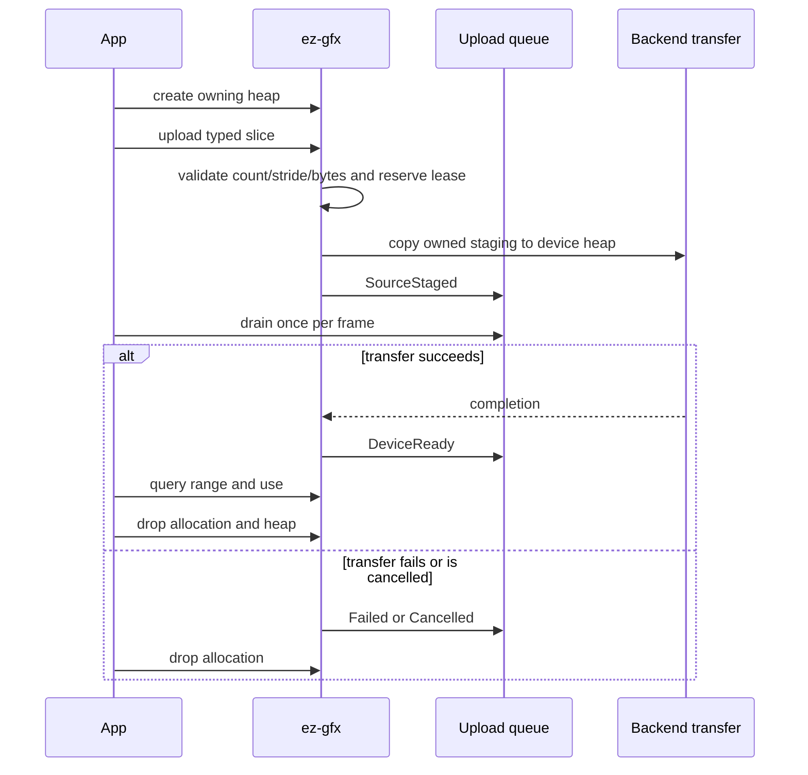

# Geometry

Geometry uses owning named vertex heaps and one singleton context-owned device-local `u32` index heap. Their allocation wrappers retain both the shared `Rc<ContextInner>` and the parent resource lease. Structured and indirect buffers are separate frame transients.

## Public path

1. Create each typed vertex heap with a unique semantic name through `Context::create_vertex_heap<T>(name)`; retain its owning `VertexHeap<T>`.
2. Call `VertexHeap::upload(&[T])` or `Context::upload_indices(&[u32])`; the index heap is created lazily, and each upload returns an owning generation-validated allocation.
3. Query `VertexAllocation::range` or `IndexAllocation::range` for indirect draw offsets.
4. Register one `Context` callback for upload, runtime, diagnostic, and readback events.
5. Drop heaps and allocations independently. Allocation leases keep their parent heap and context alive until cleanup is safe.

The safe interface exposes an owning `VertexHeap`, owning vertex/index allocations, and a context-owned singleton index heap rather than public destroy, remove, release, or free functions. Dropping an allocation retires its range; dropping a vertex heap retires it after every child lease and GPU use. C mirrors the lifecycle with opaque generational `EzGfxVertexHeap`, `EzGfxVertexAllocation`, and `EzGfxIndexAllocation` handles; index-heap creation/destruction remains explicit against `EzGfxContext`.



## Shader reflection and frame binding

A shader declares a named heap explicitly:

```slang
[VertexHeap("positions")]
StructuredBuffer<float4> positions;
```

Reflection records `VertexHeap` separately from `StructuredBuffer`. Applications do not supply a `PublicBinding` for it. Frame recording imports the named heap automatically and each backend lowers it to its private descriptor layout. Vulkan, Direct3D 12, and Metal retain distinct physical layouts behind the same public contract.

The global index heap remains a native index-buffer binding. `DrawIndexedCommand::first_index` is the queried index allocation start plus any mesh-local index offset. Because a vertex heap is bound at byte offset zero, `vertex_offset` must include the queried vertex allocation start.

## Allocation and removal

Each heap uses an ordered range free list. Allocation validates stride, capacity, arithmetic, heap ownership, handle owner, resource kind, and generation. An allocation lease retains its parent heap, so stale, foreign, wrong-kind, and duplicate C releases are rejected while safe Rust cleanup remains single-owner `Drop`.

The index heap is a context singleton, not a freely creatable family of named heaps. Range retirement remains gated by native completion; parent resources remain leased until their children and recorded uses are gone.
## Upload events

`VertexHeap::upload(&[T])` and `Context::upload_indices(&[u32])` enqueue lossless typed transitions: `SourceStaged`, `DeviceReady`, `Failed(status)`, or `Cancelled`.

`Context::register_callback` is the sole safe event channel. The facade dispatches queued events at creator-thread operation seams; applications do not poll internal runtime queues.

A heap-level maximum readiness token is used when a frame imports a named heap. It may wait for a later allocation in the same heap, but never permits early use.

## Admission and copies

Geometry staging grows subject to allocator and OS failure, not a fixed slot count. Reusable mapped buckets retire by completion token and are reused only after completion.

The typed slice upload interface derives and checks count, stride, multiplication, and byte length before one caller-slice to mapped-staging copy, followed by the GPU copy. Raw pointer/count conversion and the 16 MiB caller boundary remain in `ez-gfx-ffi`. The interface does not provide a direct mapped lease.

## Transient frame buffers

Applications call `Frame::acquire_buffer<T>(element_count)` and `Frame::acquire_counted_buffer(element_count)` through `&mut Frame`. `Buffer::write(&mut Frame, start_index, values)` and `CountedBuffer::write(&mut Frame, start_index, commands)` validate frame ownership and checked ranges.

Compute-generated indirect bytes cannot update CPU publication metadata, so callers publish the known indirect count before compute and graphics share the buffer in one frame. Transient wrappers may outlive the borrow that created them, but become invalid immediately when their frame finishes or aborts. Native reuse remains completion-gated or, after indeterminate failure, quarantined.

## Frame ownership

`Surface::begin_frame()` creates an owning target-less `Frame`; `Frame::configure_swapchain(size, format)` attaches presentation. Named targets use `Context::begin_frame()` and `Frame::configure_render_target(name, size, format)`. `Frame::finish(self)` preserves exact errors. `Drop` aborts an unfinished frame, so safe Rust exposes no frame-end, frame-abort, or transient-release functions.

## Examples

The shared `Example` host owns `Context`, `Surface`, resize/input/automation, logical swapchain configuration, callbacks, and frame completion. Each setup closure returns concise per-frame recording logic; `Example::handle_frame` consumes the frame.
