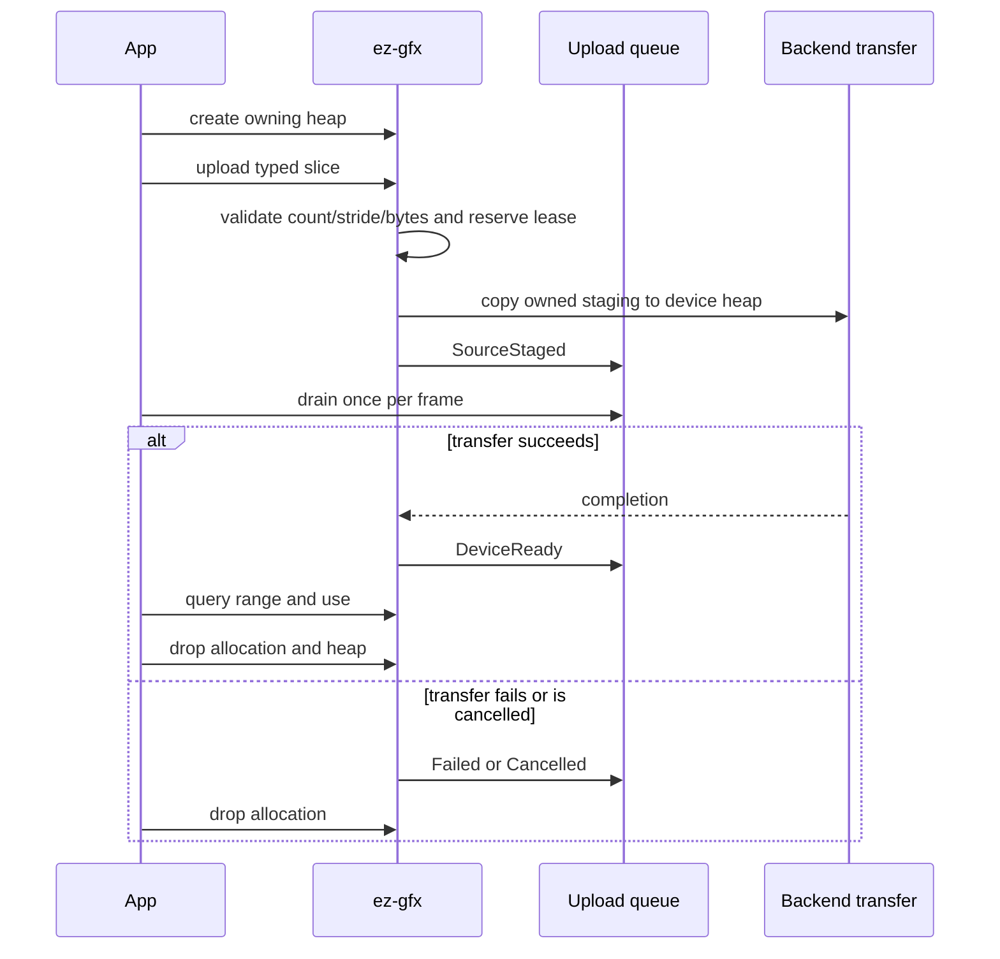

# Geometry

Geometry uses owning named vertex heaps and one singleton context-owned device-local `u32` index heap. Their allocation wrappers retain both the shared `Rc<ContextInner>` and the parent resource lease. Structured and indirect buffers are separate frame transients.

## Public path

1. Create each vertex heap with a unique semantic name, byte capacity, and stride; retain its owning `VertexHeap`.
2. Create the context's singleton index heap with a byte capacity divisible by four. A second live index heap is rejected.
3. Call `upload_vertices(&VertexHeap, &[T])` or `upload_indices(&Context, &[u32])`; each returns an owning, generation-validated allocation.
4. Query `VertexAllocation::range` or `IndexAllocation::range` for indirect draw offsets.
5. Poll upload events until empty once per frame.
6. Drop heaps and allocations independently. Allocation leases keep their parent heap and context alive until cleanup is safe.

The safe interface exposes an owning `VertexHeap`, owning vertex/index allocations, and a context-owned singleton index heap rather than public destroy, remove, release, or free functions. Dropping an allocation retires its range; dropping a vertex heap retires it after every child lease and GPU use. C mirrors the lifecycle with opaque generational `EzGfxVertexHeap`, `EzGfxVertexAllocation`, and `EzGfxIndexAllocation` handles; index-heap creation/destruction remains explicit against `EzGfxContext`.



## Shader reflection and frame binding

A shader declares a named heap explicitly:

```slang
[VertexHeap("positions")]
StructuredBuffer<float4> positions;
```

Reflection records `VertexHeap` separately from `StructuredBuffer`. Applications do not supply a `PublicBinding` for it. Frame recording imports the named heap automatically and each backend lowers it to its private descriptor layout. Vulkan, Direct3D 12, and Metal retain distinct physical layouts behind the same public contract.

The global index heap remains a native index-buffer binding. `DrawIndexedCommand::first_index` is the queried index allocation start plus any mesh-local index offset. Because a vertex heap is bound at byte offset zero, `vertex_offset` must include the queried vertex allocation start.

## Allocation and removal

Each heap uses an ordered range free list. Allocation validates stride, capacity, arithmetic, heap ownership, handle owner, resource kind, and generation. An allocation lease retains its parent heap, so stale, foreign, wrong-kind, and duplicate C releases are rejected while safe Rust cleanup remains single-owner `Drop`.

The index heap is a context singleton, not a freely creatable family of named heaps. Range retirement remains gated by native completion; parent resources remain leased until their children and recorded uses are gone.
## Upload events

`upload_vertices(&VertexHeap, &[T])` and `upload_indices(&Context, &[u32])` enqueue lossless typed transitions:

- `SourceStaged`: caller bytes were copied into runtime-owned mapped staging and may be released;
- `DeviceReady`: the device-local allocation completed transfer;
- `Failed(status)`: terminal upload failure;
- `Cancelled`: terminal cancellation where supported.

The queue is unbounded and never shares the bounded diagnostic queue. Poll until empty every frame to avoid retaining events indefinitely. The last context/resource owner drops remaining events after draining owned work.

A heap-level maximum readiness token is used when a frame imports a named heap. It may wait for a later allocation in the same heap, but never permits early use.

## Admission and copies

Geometry staging grows subject to allocator and OS failure, not a fixed slot count. Reusable mapped buckets retire by completion token and are reused only after completion.

The typed slice upload API derives and checks count, stride, multiplication, and byte length before one caller-slice to mapped-staging copy, followed by the GPU copy. Raw pointer/count conversion and the 16 MiB caller boundary remain in `ez-gfx-ffi`. The API does not provide a direct mapped lease. Procedural zero-copy staging leases remain planned work; current APIs and plans must not claim that feature is implemented.

## Transient frame buffers

Applications call `Frame::acquire_structured<T>(element_count)` and `Frame::acquire_indirect(capacity)` through `&mut Frame`. `StructuredBuffer::write(&mut Frame, start_index, values)` and `IndirectBuffer::write(&mut Frame, start_index, commands)` validate frame ownership and checked ranges; indirect writes advance the active count to the maximum written end.

Compute-generated indirect bytes cannot update CPU publication metadata, so callers publish the known indirect count before compute and graphics share the buffer in one frame. Transient wrappers may outlive the borrow that created them, but become invalid immediately when their frame finishes or aborts. Native reuse remains completion-gated or, after indeterminate failure, quarantined.

## Frame ownership

`begin_frame(&Context, &Surface)` returns an owning `Frame`; all recording methods take `&mut Frame`. `Frame::finish(self)` preserves exact submission or presentation errors. `Drop` aborts an unfinished frame, so the safe interface exposes no frame-end, frame-abort, or transient-release functions. ABI 31 keeps those operations explicit for C through opaque generational `EzGfxFrame` handles.

## Examples

The shared `Example` host owns `Context`, `Surface`, resize/input/automation, and frame completion. Each renderer closure begins and records an owning `Frame`, acquires fresh transients through `&mut Frame`, and returns the frame to `Example::handle_frame` for consuming completion.
