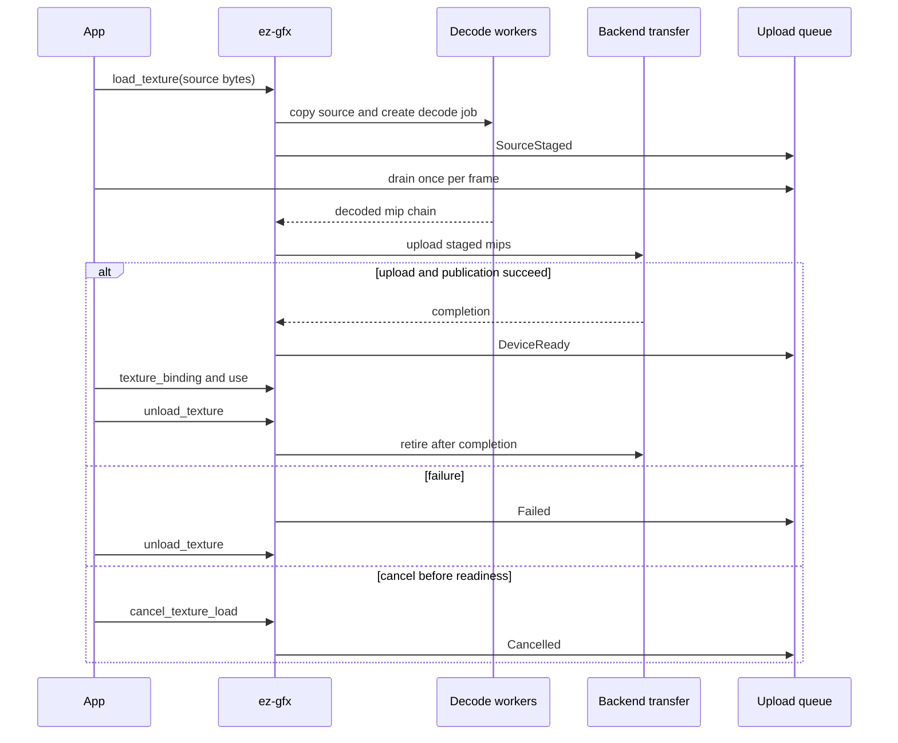

# Textures

Texture loading is asynchronous. The context owns handles and native resources, a Rayon pool performs decode/mip work, and backend transfer owners submit device copies.

## Public path

`load_texture` validates the request, copies caller source before returning, reserves a generational handle, and schedules CPU work. The context-wide lossless upload queue is authoritative; the removed per-texture poll API remains absent from ABI 30.

Poll until the queue is empty once per frame on the context creator thread. Polling also drains decoded work, admits native transfers, publishes completed texture views, and reports owner-thread failures.

Events identify a typed texture, vertex allocation, or index allocation and report:

- `SourceStaged`: the runtime owns the required CPU data, so caller source memory may be released;
- `DeviceReady`: the resource is device-local and ready for rendering;
- `Failed(status)`: terminal failure;
- `Cancelled`: terminal cancellation.

The upload queue is unbounded and lossless. It is separate from bounded runtime diagnostics. Applications must drain it regularly; otherwise queued records retain memory until polling or context destruction.

## Texture lifecycle

After a texture `DeviceReady` event, call `texture_binding` to obtain its stable bindless index. Use a resident fallback until then. `texture_binding`, `texture_residency`, and `set_texture_residency` each perform a nonblocking owner-thread progress pass that drains completed decode work, admits transfers, and publishes completed residency. `wait_idle` drains native work, then performs the same publication pass. None dequeues upload events or replaces event consumption.

`cancel_texture_load` wins only before initial readiness and emits `Cancelled`. `unload_texture` invalidates the handle and retires native storage safely. Context destruction cancels queued decode work, drains native work where possible, then drops remaining events and resources.

Device loss is terminal. Textures still in decode or awaiting transfer completion receive a terminal `Failed(DeviceLost)` event. Textures whose readiness was already published are not in that pending set and do not receive a retroactive upload failure.

## Residency and updates

Initial readiness requires a completed coarse mip range and a frame-safe published descriptor. Finer mips may continue transferring after `DeviceReady`.

`texture_residency` returns the exposed contiguous coarse mip count and immutable total. `set_texture_residency` accepts `1..=total`; growth returns `NotReady` until required transfers and descriptor publication complete. `update_texture_region` validates mip bounds, block alignment, row pitch, and byte length before scheduling a copy.

## Admission and memory

CPU jobs, the decoded-result channel, and backend transfer request channels have no fixed job-count or aggregate-byte backpressure. Scheduling is limited by actual allocation, counter, thread, or OS failure. `QueueFull` remains a representable ABI status for genuine counter/channel failure, not routine texture admission control.

Real request boundaries remain:

- runtime texture payloads: at most 64 MiB per request;
- C ABI caller ranges: at most 16 MiB;
- decoder worker threads: `1..=256`, with zero selecting the default count;
- texture handle and bindless descriptor capacity: finite and validated.

Transfer workers coalesce adjacent compatible requests according to staging policy byte/copy/deadline thresholds. Those are batch-flush thresholds, not admission limits. Reusable mapped staging buckets are reclaimed only after their completion token retires and trimmed after idle epochs.

## Texture heap capacity

The maximum is currently 1024 textures. This is one synchronized semantic/runtime/backend contract: core capability admission, compiler and HAL reflection validation, runtime handle allocation, Vulkan and Direct3D 12 descriptor counts, Metal argument-buffer layout, and `EZ_GFX_MAX_TEXTURES` all agree.

Slang requires a compile-time static array length for the cross-target `ParameterBlock<TextureHeap>` layout, so the shader declaration cannot represent an independently larger runtime heap. The maximum is technically required by the current Vulkan, Direct3D 12, and Metal layouts; it is not an incidental shader-only cap. Raising it requires one authoritative contract change across every layer plus device-capability admission. Arbitrary runtime growth is unsupported while those static layouts remain.

## Copy ownership

C calls copy borrowed source bytes during the call, preserving asynchronous lifetime safety. Encoded input must remain decode-owned until decoding finishes. Decoded/native payloads are copied into mapped staging before device transfer. The current texture API does not expose a caller-writable mapped staging lease, so it must not be described as zero-copy.

## C ABI 30

Use `ez_gfx_poll_upload_event(&event, &present, context)` until `present == 0` each frame. When `event.resource_kind == EzGfxUploadResourceKind_Texture`, compare `event.resource` with the retained texture handle. On `EzGfxUploadStatus_DeviceReady`, resolve the binding. On `Failed` or `Cancelled`, retire the request or continue with a fallback. Convert result codes with `ez_gfx_print_error` into caller-owned storage.

`ez_gfx_texture_poll` was removed. `ez_gfx_texture_load`, cancellation, binding, residency, region updates, telemetry, and unload remain.

## Synchronization

Frame recording imports only resources referenced by active work. Texture descriptor publication is guarded by transfer and graphics completion. Vulkan and Direct3D 12 still use conservative host waits in parts of the transfer handoff; Metal has nonblocking submission coverage. Removing those remaining waits is tracked separately and is not claimed complete here.

## Verification and remaining evidence

Pure queue and allocator transitions are covered by runtime tests. ABI layout/export tests cover event records, typed heap/allocation handles, transient buffer signatures, and ABI 30 parity. Native backend behavior requires the Linux Vulkan, Windows DX12, and macOS Metal remote matrices.
