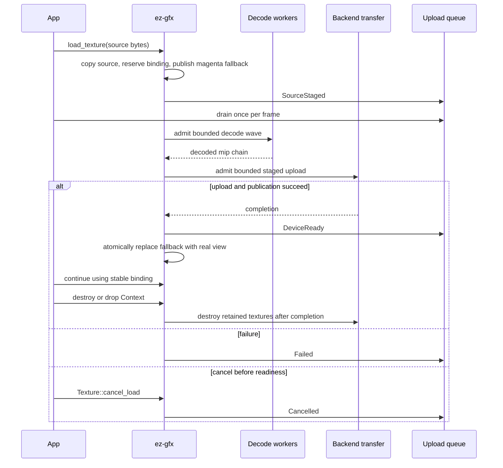

# Textures

Texture loading is asynchronous. Each context/device owns one 1×1 opaque-magenta sampled texture. Every safe `Texture` is a typed view into the context-owned bindless heap; dropping the wrapper does not unload or recycle its texture. A Rayon pool performs decode/mip work and backend transfer owners submit device copies.

## Public path

`Context::load_texture` validates the request, copies caller source, reserves a generational lease, and publishes that stable slot as an alias of the shared fallback before returning. Device initialization backfills loads queued before a frame-capable device existed. Every alias uses the fallback's one context-owned sampler; a uniform 1x1 texel is invariant under filtering, addressing, and anisotropy. Real publication installs the request's sampler with its texture. The manager then admits decode and native transfer waves under its working-set budget. Register one creator-thread callback with `Context::register_callback`; graphics safe points drain the lossless upload queue, advance queued and decoded work, publish completed views, and report failures.

Binding queries preserve terminal status precedence: failed textures return their typed failure and lost contexts return `DeviceLost`; the fallback never converts either condition into success. The Sponza example keeps normal interactive and hidden runs streaming, while snapshot/golden runs use one startup synchronization point so reference pixels are deterministic.

Events identify a typed texture, vertex allocation, or index allocation and report:

- `SourceStaged`: the runtime owns the required CPU data, so caller source memory may be released;
- `DeviceReady`: the resource is device-local and ready for rendering;
- `Failed(status)`: terminal failure;
- `Cancelled`: terminal cancellation.

The upload queue is unbounded and lossless. It is separate from bounded runtime diagnostics. Applications must retain a callback and regularly reach graphics safe points; otherwise queued records retain memory until context destruction.

## Texture lifecycle

Obtain the stable bindless index immediately after `load_texture` succeeds. Until `DeviceReady`, that index safely samples opaque magenta. CPU decode and native upload remain asynchronous. At a graphics-safe descriptor-update gate, the same slot changes from the fallback alias to the completed real coarse view. Binding lookup does not poll or wait for real uploads; residency operations retain their existing nonblocking progress behavior. `Context::wait_idle` still drains all manager work when explicitly requested.

Cancellation wins only before initial real readiness and emits `Cancelled`. Decode, upload, cancellation, and failure paths leave the slot pointing at fallback until safe reuse; reuse republishes fallback before returning the new texture. Dropping `Texture` releases only the Rust wrapper; the context retains its heap entry and native storage so stable bindless IDs remain valid until `Context::destroy` or context drop. Context teardown drains native work where possible, then destroys real textures and the shared fallback.

Device loss is terminal. Textures still in decode or awaiting transfer completion receive a terminal `Failed(DeviceLost)` event. Textures whose real readiness was already published are not in that pending set and do not receive a retroactive upload failure.

## Residency and updates

Initial readiness requires a completed coarse mip range and a frame-safe published descriptor. Finer mips may continue transferring after `DeviceReady`.

`Texture::residency` returns the exposed contiguous coarse mip count and immutable total. `Texture::set_residency` accepts `1..=total`; growth returns `NotReady` until required transfers and descriptor publication complete. `Texture::update_region` validates mip bounds, block alignment, row pitch, and byte length before scheduling a copy.

## Admission and memory

Texture admission is nonblocking and FIFO. Accepted sources remain manager-owned while queued; callers submit textures naturally and never choose a batch size or retry routine `QueueFull`. The manager reserves the 64 MiB per-request maximum for each active decode and limits decoded plus in-flight native-transfer work to a 256 MiB window. Completed small uploads release reservations before later waves, while an otherwise-valid request that exceeds an empty window is admitted alone so progress cannot deadlock. The synchronous decoded-to-staging copy may transiently duplicate one admitted chain, but queued decoded results and in-flight staging cannot grow with the full submission set.

The result channel remains mechanically lossless and unbounded, but only manager-permitted jobs can publish into it, so payload occupancy is bounded by the same reservations. Backend transfer queues retain their existing all-or-none chain submission and adaptive coalescing. Vulkan, Direct3D 12, and Metal staging buckets are each capped at the shared 64 MiB request maximum; holding a manager reservation through the final mip completion token therefore bounds active native staging without a backend interface change.

Real request boundaries remain:

- runtime texture payloads: at most 64 MiB per request;
- C ABI caller ranges: at most 16 MiB;
- decoder worker threads: `1..=256`, with zero selecting the default count;
- texture handle and bindless descriptor capacity: finite and validated.

Transfer workers coalesce adjacent compatible requests according to staging policy byte/copy/deadline thresholds. Those are batch-flush thresholds, not caller admission limits. Reusable mapped staging buckets remain completion-gated and are reused or trimmed by the backend; the manager separately bounds active decoded and transfer payloads.

### Sponza fixture encoding

`examples/shared/assets/sponza.glb` retains the immutable-reference fixture encoding recorded in the asset itself. Its GLB metadata names `glTF-Transform v4.4.1`; `KHR_texture_basisu` references 69 KTX2 images. Every image has undefined `vkFormat`, DFD color model 163 (ETC1S), and supercompression scheme 1 (BasisLZ). Every KTX2 payload names `ktx create v4.4.2 / libktx v4.4.2` as its writer. Embedded `KTXwriterScParams` are `--threads 2` for 45 images and `--no-endpoint-rdo --no-selector-rdo --threads 2` for 24 images. Only metadata embedded in the checked-in bytes is treated as provenance.

## Texture heap capacity

The maximum is currently 1024 textures. This is one synchronized semantic/runtime/backend contract: core capability admission, compiler and HAL reflection validation, runtime handle allocation, Vulkan and Direct3D 12 descriptor counts, Metal argument-buffer layout, and `EZ_GFX_MAX_TEXTURES` all agree.

Slang requires a compile-time static array length for the cross-target `ParameterBlock<TextureHeap>` layout, so the shader declaration cannot represent an independently larger runtime heap. The maximum is technically required by the current Vulkan, Direct3D 12, and Metal layouts; it is not an incidental shader-only cap. Raising it requires one authoritative contract change across every layer plus device-capability admission. Arbitrary runtime growth is unsupported while those static layouts remain.

## Copy ownership

C calls copy borrowed source bytes during the call, preserving asynchronous lifetime safety. Encoded input must remain decode-owned until decoding finishes. Decoded/native payloads are copied into mapped staging before device transfer. The current texture API does not expose a caller-writable mapped staging lease, so it must not be described as zero-copy.

## Frame ownership

Texture bindings are recorded only through `&mut Frame`; the context-owned texture heap requires no per-frame retain call. Surface recording uses `Surface::begin_frame()` and `Frame::configure_swapchain`; named targets use `Context::begin_frame()` and `Frame::configure_render_target`. `Frame::finish(self)` preserves exact errors, while dropping an unfinished frame aborts. `Buffer<T>`, `CounterBuffer<T>`, and single-value `ValueBuffer<T>` are one-frame values: their first execute use claims them, current bindings persist across same-frame execute calls, and terminal frame paths clear bindings and invalidate claimed public use while native backing remains completion-gated. `RenderTarget::prepare_readback(&mut frame)` creates and attaches an opaque owner-and-generation request, and completed metadata and bytes exist only during the registered callback.

## Render-target readback

Managed render-target readback supports only full-image `Rgba8Unorm`; `Bgra8Srgb`, `Rgba16Float`, compressed, and depth targets fail before graph recording because backend copies do not convert texels. Safe `RenderTarget::prepare_readback(&mut frame)` returns an opaque owner-and-generation `Readback`; ABI 41 `ez_gfx_frame_enqueue_render_target_readback(context, frame, render_target, out_request_id)` returns a stable request correlator instead. Presented images use the presented-capture path and report no source handle. The correlator is reserved in graph insertion order and written only on success; a failed insertion cancels the reservation. Callback events pair opaque `readback_source` with `readback_source_kind`: texture requests report `Texture`, render-target requests report `RenderTarget`, and unrequested snapshots report `None` with a zero handle. The extent and RGBA bytes remain valid only for the callback invocation.
## C ABI 41

Install `ez_gfx_context_register_callback(context, callback, user_data)`. The callback receives `EzGfxEventKind_Upload`, runtime, diagnostic, dropped-count, and readback events on the context creator thread at graphics safe points. `ez_gfx_texture_get_binding` succeeds immediately after a successful load; the returned slot samples fallback until `EzGfxUploadStatus_DeviceReady` identifies real publication. Copy readback bytes before the callback returns. Passing a null callback clears the registration. Convert result codes with `ez_gfx_error_print`.

C retains explicit context-first texture load, cancellation, binding, residency, region-update, telemetry, resource-diagnostics, and unload functions because RAII is available only through the safe Rust interface. `ez_gfx_context_get_resource_diagnostics` fills an `EzGfxResourceDiagnostics` struct with pending-upload counts, retained bytes, and cache sizes; it rejects null outputs and stale handles like every other context query.

## Pending-upload and cache diagnostics

`Context::resource_diagnostics` returns a point-in-time `ResourceDiagnostics` snapshot, distinct from the monotonic `texture_upload_telemetry` counters. `pending_textures` counts uploads queued for decode, holding decoded output, or awaiting their final transfer completion. `pending_texture_bytes` reports owned source bytes before decode completion, decoded bytes awaiting native admission, and decoded payload bytes after native submission. Staging sizes aggregate retained bucket capacity across the shared, buffer, and counter pools; `pipeline_entries` counts retained compiled pipelines and `readback_bytes` aggregates retained readback frames. Counts and bytes saturate instead of wrapping. The query observes creator-thread state without requiring device health, so teardown titles keep reporting after loss until destruction.

## Staging retention budgets and memory telemetry

Upload staging reuses best-fit buckets across the shared, per-stride buffer, and counter pools. Each pool carries a finite retention ceiling (32 MiB shared, 16 MiB per buffer-stride entry, 8 MiB counter); `put` never evicts, and only explicit trims enforce the ceiling. Per-pool ceilings cannot bound the stride map, which grows one pool per element width, so a 64 MiB context-wide aggregate ceiling caps their sum: enforcement evicts the largest completed bucket across every pool until the total fits, without touching in-flight buckets and without affecting best-fit reuse order.

`Context::memory_telemetry` reports allocator telemetry (via one `generate_report` per query, never per frame), retained staging totals with the true aggregate high-water across pools, counter serialization capacity, and decode worker counts. Surface image counts, extents, formats, and depth bytes aggregate active safe surface state in one convention on every backend: extents prefer the safe surface extent, Vulkan contributes device swapchain fields, DX12 contributes back-buffer counts with its R8G8B8A8 format code, and Metal contributes drawable counts with its BGRA8 sRGB code. Zero images gates extent and format to unknown. The async decode pool builds lazily before admission, so a rejected load leaves no registry, identity, or pending residue.

## Synchronization

Device initialization waits only for creation/publication of the shared fallback before any frame can sample. Later frames never globally wait for pending real texture uploads. Real descriptor/view replacement reuses each backend's graphics-completion publication gate; Vulkan, Direct3D 12, and Metal therefore expose the same fallback-to-real contract while preserving existing streaming and residency completion rules.

## Verification and remaining evidence

Pure queue and allocator transitions are covered by runtime tests. ABI layout tests cover callback event records, typed heap/allocation handles, one-frame buffer signatures, presentation modes, the resource-diagnostics struct and export, and the ABI 41 contract. Native backend behavior requires the Linux Vulkan, Windows DX12, and macOS Metal remote matrices.
