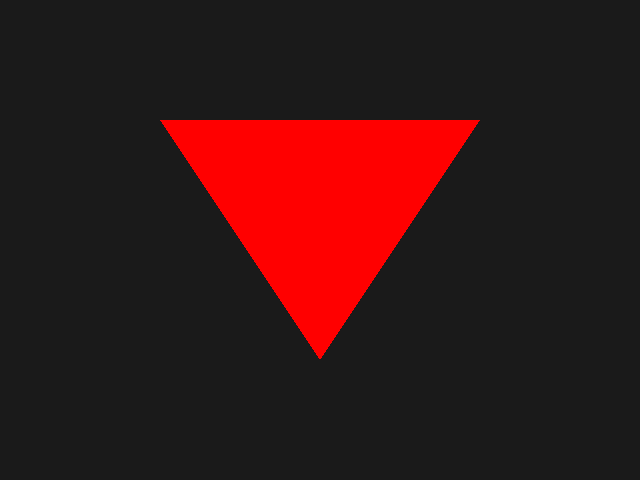

# Triangle

Showcases the smallest safe `ez-gfx` graphics path: named vertex-heap data, an index heap, one indexed-indirect draw, and a compiled shader artifact.

`main.rs` reads top-to-bottom: setup creates typed geometry and shader owners, then returns a per-frame closure. The shared host supplies a configured `Frame`; the closure acquires a `CountedBuffer`, writes one draw, records graphics, and passes the frame to `Example::handle_frame`.

Run:

```text
mise run example-1
```



Expected result: a solid red triangle centered in the 640×480 presentation surface.
