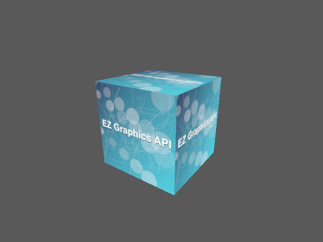

# Textured Cube

Showcases indexed geometry, an orbit camera, push-constant MVP data, PNG texture upload, and bindless texture selection.

`main.rs` reads top-to-bottom through the shared host setup closure: it creates owning vertex/index allocations, a texture, and a shader, then returns a concise per-frame closure. Each frame calls `begin_frame`, acquires and writes an `IndirectBuffer` through `&mut Frame`, records textured graphics with typed bindings and `DynamicPipelineState`, and returns the owning `Frame` to `Example::handle_frame` for consuming submission and presentation. Resource wrappers release through `Drop`.

Run:

```text
mise run example-2
```



Expected result: a shaded, textured cube viewed from an elevated orbit-camera angle.
