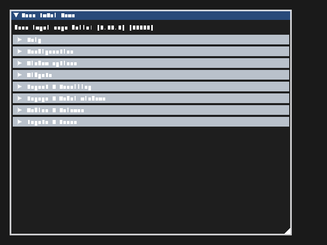

# Dear ImGui

Showcases Dear ImGui integration: font-atlas upload, CPU draw-data flattening, named geometry heaps, bindless texture sampling, clip rectangles, and per-command indirect draws.

`main.rs` loads the font atlas and resolves its texture binding after readiness. The native global index heap contains the original identity sequence; named heaps contain vertex records and shader-index records. This preserves the original `SV_VertexID` plus shader-index lookup semantics while removing public structured geometry allocations. Dedicated heap ranges are validated as zero-based after safe replacement.

Run:

```text
mise run example-4
```



Expected result: the Dear ImGui demo window and controls rendered over the presentation surface.
