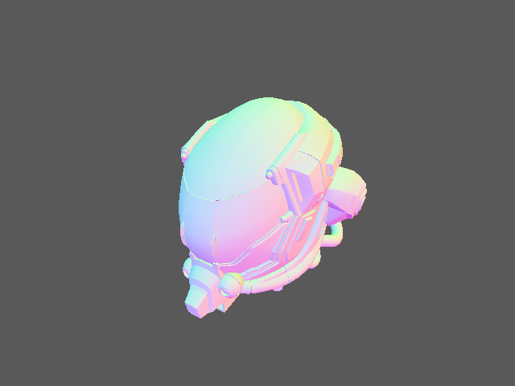

# Helmet

Showcases loading a GLB model into named position and normal vertex heaps plus structured primitive buffers, then using compute-generated indirect commands for depth-tested graphics.

`main.rs` reads top-to-bottom through the shared host setup closure: it loads `helmet.glb`, creates owning position/normal heaps and vertex/index allocations, and loads the universal shader artifact. The returned per-frame closure calls `begin_frame`, acquires and writes frame-local structured and indirect buffers through `&mut Frame`, records compute-generated indexed commands followed by depth-tested graphics, and returns the owning `Frame` to `Example::handle_frame`. Persistent wrappers release through `Drop`.

Run:

```text
mise run example-5
```



Expected result: a centered helmet model shaded from its transformed normals.
