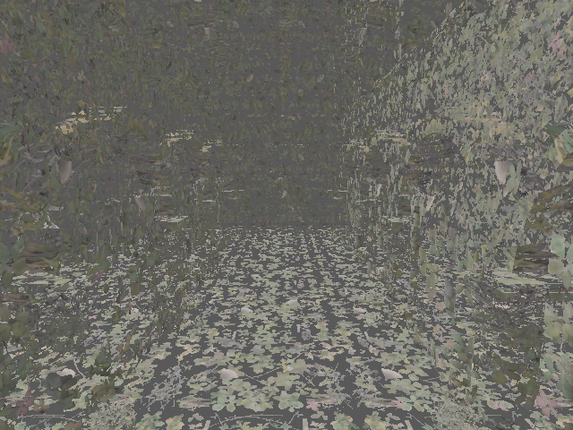

# Sponza KTX2

Showcases compressed KTX2 material textures, bindless per-primitive texture IDs, structured GLB data, and a compute-to-graphics indirect rendering flow.

`main.rs` reads top-to-bottom: setup loads Sponza, validates KTX2 images, and creates owning texture, geometry, and shader wrappers. The linear frame loop acquires one-frame structured and counter buffers, explicitly configures the swapchain, records compute-generated commands and textured graphics, then passes the frame and target to `Example::handle_frame`.

Run:

```text
mise run example-6
```



Expected result: a textured Sponza atrium with normal-based lighting and transparent material cutouts.
